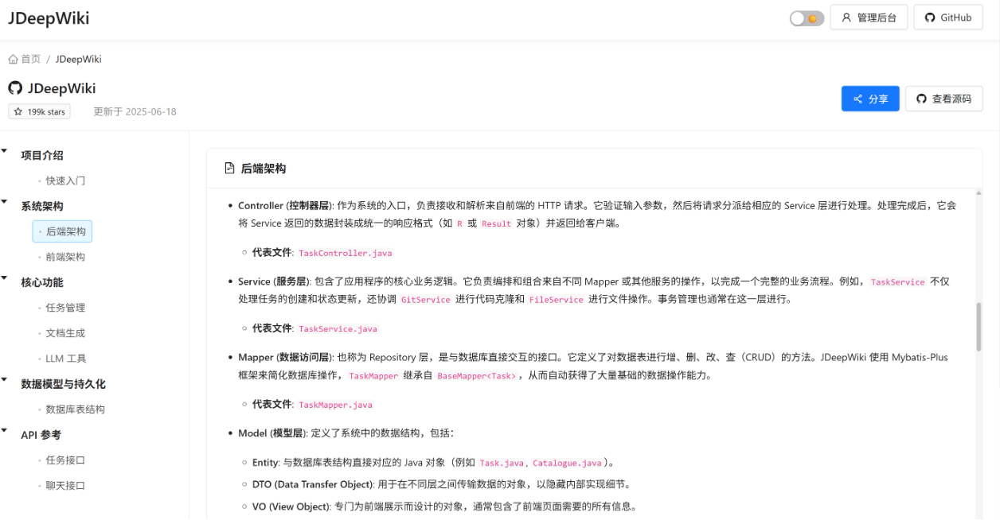
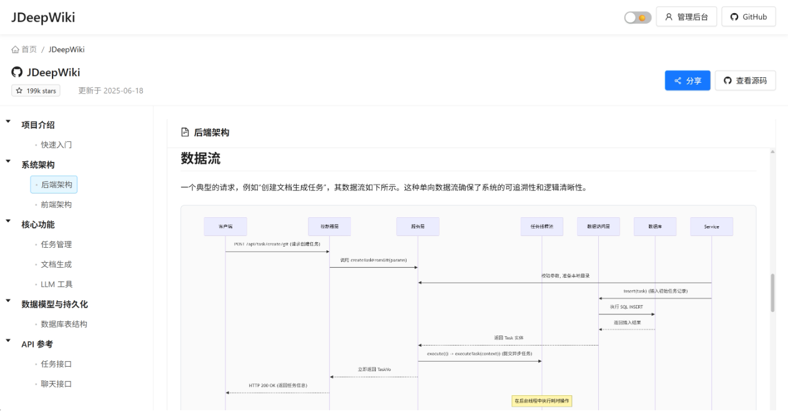
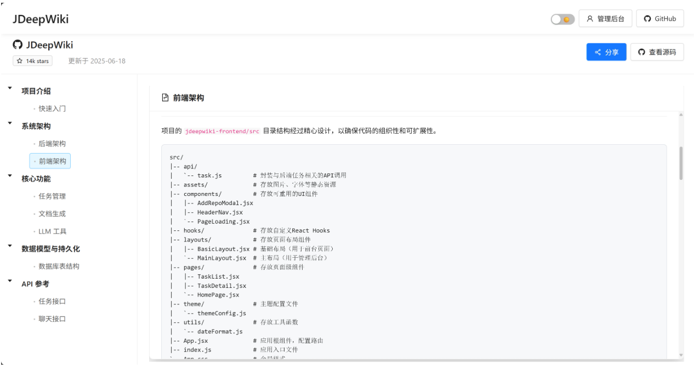
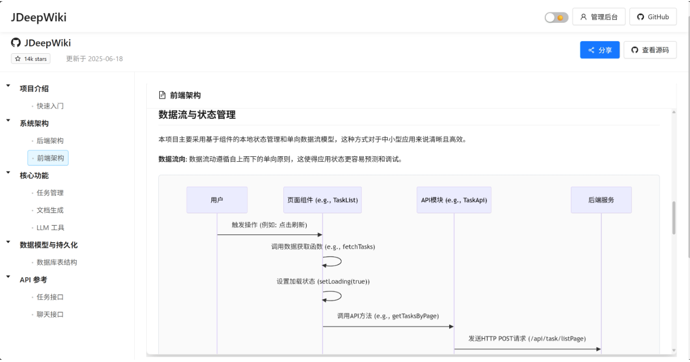
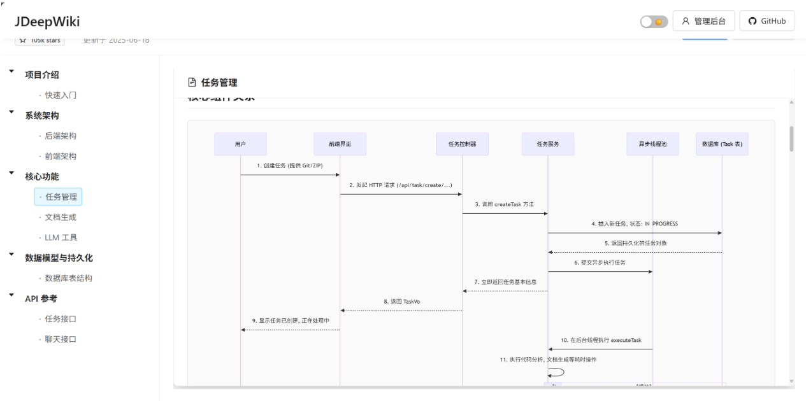
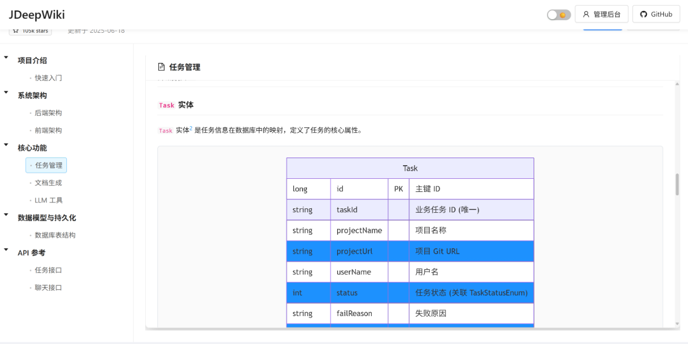
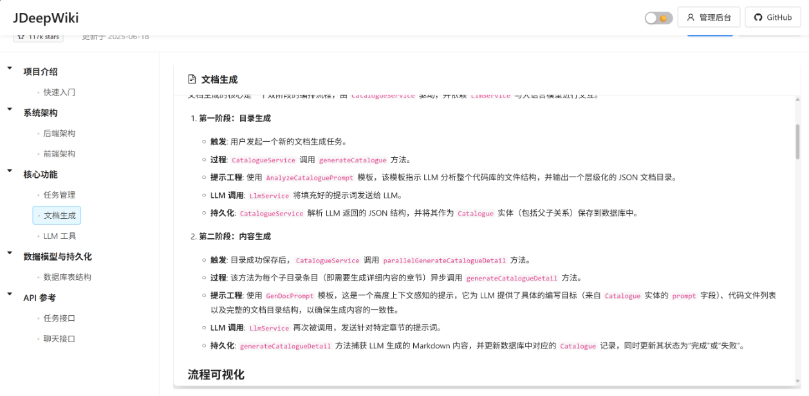
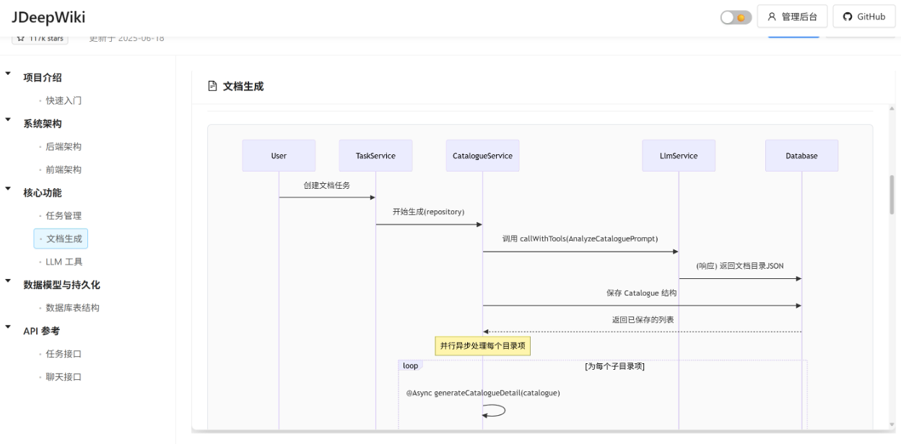

## DeepWiki快速入门
**本文档由DeepWiki自动生成**

## Executive Summary
本指南旨在引导开发者完成 DeepWiki 项目的初始设置。内容涵盖了从环境准备到成功运行前后端服务的每一个步骤，并对常见问题提供了解决方案。无论您是初学者还是经验丰富的开发者，都可以按照本指南快速开始。

## 系统架构
在开始之前，了解 DeepWiki 的基本架构有助于更好地理解设置过程。JDeepWiki 采用前后端分离的设计：
- **后端**：基于 Java 和 Spring Boot 构建，负责核心业务逻辑、文档生成和与大语言模型 (LLM) 的交互。
- **前端**：基于 React 构建，提供用户界面，用于仓库管理、任务创建和文档展示。

```mermaid
graph TD
    subgraph "jdeepwiki-frontend (React)"
        direction LR
        A[用户界面] --> B{API 请求}
    end
    subgraph "jdeepwiki (Spring Boot)"
        direction LR
        C[API 端点] --> D[业务逻辑]
        D --> E{LLM 服务}
        D --> F[(SQLite 数据库)]
    end
    B --> C
```

## 核心组件
- **`jdeepwiki`**: 后端 Spring Boot 应用程序。
- **`jdeepwiki-frontend`**: 前端 React 应用程序。
- **`pom.xml`**: 后端 Maven 项目配置文件，定义了依赖和构建方式。[^1]
- **`package.json`**: 前端项目配置文件，定义了依赖和脚本。[^2]
- **`application.yml`**: 后端应用核心配置文件。[^3]

## 1. 环境先决条件
在开始之前，请确保您的开发环境中已安装并正确配置了以下软件：

- **Java Development Kit (JDK)**: 项目需要 **Java 21** 或更高版本。您可以在 `pom.xml` 文件中确认这一点：
  ```xml
  <properties>
      <maven.compiler.source>21</maven.compiler.source>
      <maven.compiler.target>21</maven.compiler.target>
  </properties>
  ```

- **Maven**: 用于构建后端项目和管理依赖。推荐使用 3.8.x 或更高版本。

- **Node.js**: 用于运行前端应用。推荐使用 **Node.js 20.x** 或更高版本。

- **Git**: 用于从版本控制系统中克隆项目仓库。

## 2. 克隆仓库
使用 Git 克隆 JDeepWiki 项目到您的本地计算机。

```bash
git clone https://github.com/Dreamxxxxxx/Deepwiki-java.git
cd JDeepWiki
```

## 3. 后端设置
后端服务是整个系统的核心，负责处理所有业务逻辑。

### 3.1. 配置应用程序
后端的主要配置位于 `jdeepwiki/src/main/resources/application.yml`。通常，项目中会提供一个 `application.yml.template` 文件作为模板。您需要将其复制并重命名为 `application.yml`，然后根据您的环境进行修改。

**步骤**:
1.  导航到 `jdeepwiki/src/main/resources/` 目录。
2.  复制 `application.yml.template` (如果存在) 并重命名为 `application.yml`。如果模板不存在，请直接创建或修改 `application.yml`。
3.  打开 `application.yml` 文件并配置以下关键项：

    - **LLM API 密钥**: 这是项目与大语言模型服务通信的凭证。请将其替换为您自己的有效密钥。
      ```yaml
      spring:
        ai:
          openai:
            # 如果您使用其他兼容OpenAI的API，请修改此URL
            base-url: https://openrouter.ai/api 
            # 必须替换为您自己的API Key
            api-key: sk-or-v1-xxxxxxxxxxxxxxxxxxxxxxxxxxxxxxxx
      ```

    - **数据库配置**: 项目默认使用 SQLite，数据库文件会自动在项目根目录下的 `data` 文件夹中创建，通常无需修改。
      ```yaml
      spring:
        datasource:
          url: jdbc:sqlite:./data/jdeepwiki_db.sqlite
          driver-class-name: org.sqlite.JDBC
      ```

### 3.2. 安装依赖并运行
1.  打开终端，导航到后端项目根目录 `jdeepwiki/`。
2.  使用 Maven 安装所有必需的依赖项：
    ```bash
    mvn clean install
    ```
3.  运行后端开发服务器：
    ```bash
    mvn spring-boot:run
    ```
    当您在控制台看到类似 `Started JdeepwikiApplication in X.XXX seconds` 的输出时，表示后端服务已在 `http://localhost:8888` 上成功启动。

## 4. 前端设置
前端应用负责提供用户交互界面。

### 4.1. 安装依赖
1.  打开一个新的终端窗口，导航到前端项目根目录 `jdeepwiki-frontend/`。
2.  使用 `npm` (或 `yarn`) 安装所有依赖项：
    ```bash
    npm install
    ```

### 4.2. 运行开发服务器
1.  安装完依赖后，在 `jdeepwiki-frontend/` 目录下运行以下命令：
    ```bash
    npm start
    ```
2.  此命令将启动前端开发服务器，并自动在浏览器中打开 `http://localhost:3000`。

至此，JDeepWiki 的前端和后端服务都已在您的本地计算机上成功运行。

本地调试可强制浏览器可跨域，参考
https://juejin.cn/post/7445888289591164991

## 5. 结果展示









