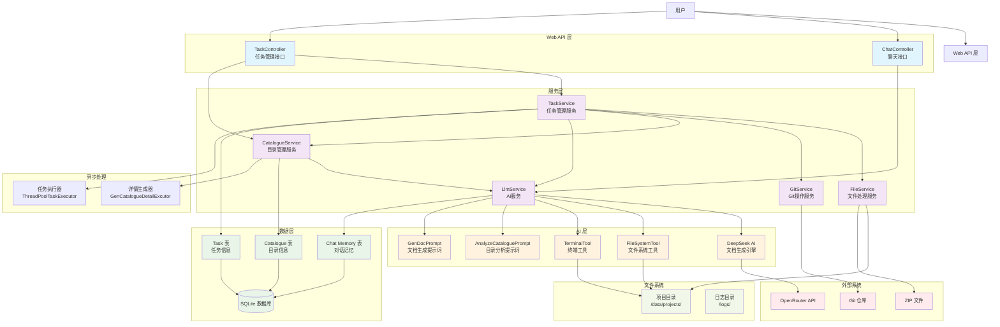

# JDeepWiki 系统架构图



## 系统组件详细说明

### 1. Web API 层
- **ChatController**: 提供AI聊天接口，支持工具调用
- **TaskController**: 提供任务管理REST API，包括创建、查询、更新、删除任务

### 2. 服务层
- **TaskService**: 核心任务管理服务，处理任务生命周期
- **CatalogueService**: 目录管理服务，负责文档结构生成和内容生成
- **FileService**: 文件处理服务，处理ZIP解压、文件树生成等
- **GitService**: Git操作服务，负责仓库克隆
- **LlmService**: AI服务封装，管理与大语言模型的交互

### 3. AI 层
- **DeepSeek**: 核心AI模型，负责文档生成
- **FileSystemTool**: 文件系统工具，可读取项目文件内容
- **TerminalTool**: 终端工具，可执行系统命令
- **AnalyzeCataloguePrompt**: 目录分析提示词模板
- **GenDocPrompt**: 文档生成提示词模板

### 4. 数据层
- **SQLite**: 轻量级数据库
- **Task表**: 存储任务信息（状态、项目名、用户等）
- **Catalogue表**: 存储文档目录结构（标题、内容、父子关系等）
- **Chat Memory表**: 存储AI对话记忆

### 5. 外部系统
- **Git仓库**: 源代码仓库
- **ZIP文件**: 压缩的项目文件
- **OpenRouter API**: AI模型访问接口

### 6. 文件系统
- **项目目录**: 存储解压的项目文件
- **日志目录**: 存储系统运行日志

### 7. 异步处理
- **任务执行器**: 处理长时间运行的任务
- **详情生成器**: 并行生成文档详情

## 数据流说明

1. **任务创建流程**:
   ```
   用户 → TaskController → TaskService → FileService/GitService → 项目目录
   ```

2. **文档生成流程**:
   ```
   TaskService → CatalogueService → LlmService → DeepSeek → 文档内容
   ```

3. **AI交互流程**:
   ```
   用户 → ChatController → LlmService → 工具调用 → 文件系统/终端
   ```

4. **数据存储流程**:
   ```
   服务层 → MyBatis-Plus → SQLite数据库
   ```

## 技术特点

- **微服务架构**: 各服务职责明确，松耦合
- **异步处理**: 支持长时间运行的文档生成任务
- **AI集成**: 深度集成大语言模型，支持工具调用
- **数据持久化**: 使用SQLite存储任务和文档信息
- **RESTful API**: 提供标准的REST接口
- **工具扩展**: 支持文件系统和终端工具调用 